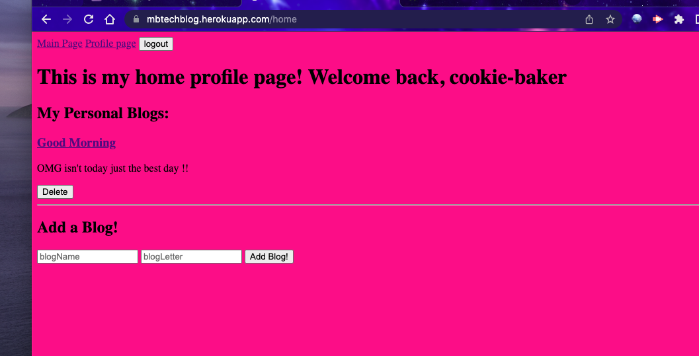
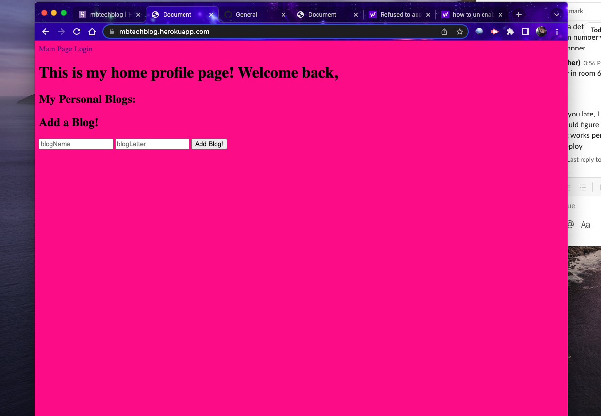

# techBlog
Did you ever just want to blog out your thoughts? Well this project can help you with just that! This tech blog app allows a user to login and create, and delete blogs they post. Maybe you want to vent about your day, or warn another girlfriend of a red flag they saw in a guy. Well you can have it all here in this app!
## Installation

## Use

## Resources
I used the examples of the mini project in class for this week to get a good view and understanding of how to get this project working. I utilized the layout of this example to form my project.
## Mock up

## Contact
git hub- https://github.com/mfarrell23/techBlog.git
heroku - https://mbtechblog.herokuapp.com/